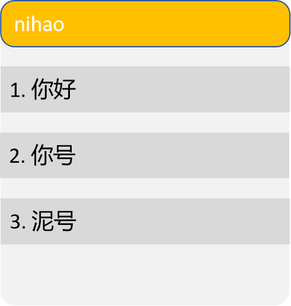
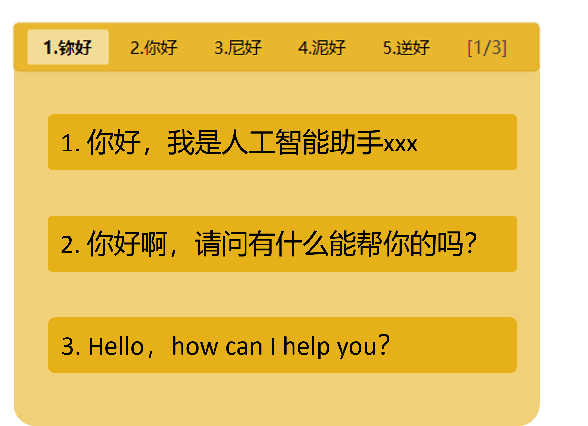

# 基础功能

基础输入法TabTab

### 输入法界面配置
1. 联想词采用上排列
2. 界面背景色：#E9B72D 黑字的 可浮动输入法界面，UI实现请参考

### 主要特点：
- **纯Python实现**: 使用Python全栈开发，简化开发难度和维护成本
- **全局键盘监听**: 通过Python库实现全局键盘事件捕获
- **拼音引擎集成**: 集成开源拼音转换引擎，支持基础拼音输入
- **词库兼容性**: 兼容rime等输入法的预定义词库格式
- **能够监听键盘输入**： 监听键盘输入，包括课件字符和不可见字符和功能键
- **Tab确认**： 单击Tab键确认光标选中的候选词

1. **Python输入法客户端**:

   - 维护输入缓冲区和候选词窗口
   - 实现拼音到汉字的转换
   - 与AI服务通信获取补全建议
   - 响应Tab键触发补全操作

### 词库兼容:
- **词库解析**: PyYAML 解析rime词库文件
- **模糊匹配**: Levenshtein 算法实现模糊音匹配
- **词库**：  使用本地的assets\8105.dict.yaml 文件作为基础词库，实现拼音到汉字转换和输入


## 主要开发任务:

1. **Python输入法核心开发**:
   - 实现全局键盘事件监听
   - 开发浮动输入窗口和候选词展示，窗口需要能被鼠标拖动
   - 实现基础拼音输入功能

   -
## 功能点
1. 使用单击tab键确认输入；
2. 候选词过多的时候可以通过键盘上下键选择备选项
3. 当输入法内容被输入到输入框之后，要把输入法内的原有内容清空 
4. 输入对应能把内容输入到输入框中，


# 加入AI

## 功能愿景
1. 用户输入拼音之后，在选定候选词之后，双击Tab键，输入法会将当前输入的拼音和候选词发送给AI服务进行补全，AI会返回三条补全之后的输入内容（每条都不会超过30字）；
2. 输入法会在下方位置展示AI返回的三条补全内容，用户可以通过Tab键+数字键（例如：tab+1，选中第一条补全内容）也可以使用上下键选择补全内容，使用tab键确认输入；
3. UI界面如图所示：

## 功能实现方案：
1. 本地AI服务的调用方式：
```python
      from ollama import Client
      client = Client(
      )
      response = client.chat(model='qwen2.5:0.5b', messages=[
      {
         'role': 'user',
         'content': f"请继续补全剩下的文本，不要提供任何解释或多余的文字，只返回补全的内容，要求返回3条补全之后的对话，结果以list的形式返回，格式为：[respone1, response2, response3]. 注意：1. 只要3条内容，不能多也不能少，2. 3条内容要各不相同，尽可能差异化；3. 每条回复必须少于30个字：{text}",
      }
   ])

      print(response.get("message")["content"])

2. 输入法监听键盘的双击Tab事件：
   - 当用户输入拼音并选中候选词后，双击Tab键触发AI补全请求
   - 将当前输入的拼音和候选词发送给AI服务，并获取补全结果，最后将结果显示在候选词窗口

3. 要求两次双击之间的间隔时长要大于3秒，自动过滤3s以内的输入和请求，避免误触和服务器压力过大。

# 添加场景

## 功能愿景

3. 用户可以通过热键切换场景，输入法会根据场景加载对应的提示词和设置；


